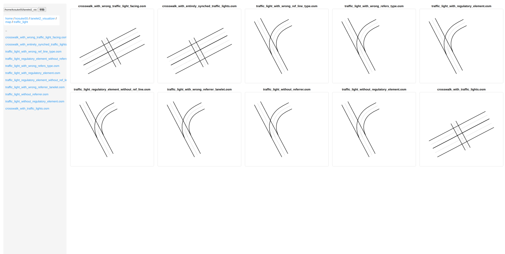

# lanelet2_visualizer

Lanelet2の地図データ（.osmファイル）をブラウザで可視化するためのシンプルなビューワーです。

## サンプルマップの表示例



上記は以下のような異なるパターンのマップの表示例です：
- 横断歩道と信号機の組み合わせ
- 信号機の参照関係
- 規制要素の設定
など

## 機能

- Lanelet2の.osmファイルの読み込みと可視化
- レーンレットの境界線と中心線の表示
- インタラクティブな操作（ズーム、パン）
- フルスクリーン表示対応
- ディレクトリ内の複数マップの一括表示

## 必要条件

- Python 3.x
- Flask 3.0.2
- Lanelet2 1.2.1
- NumPy 1.26.4
- ROS2 Humble（autoware_lanelet2_extension_pythonが必要）

## インストール

1. リポジトリをクローン：
```bash
git clone https://github.com/kosuke55/lanelet2_visualizer.git
cd lanelet2_visualizer
```

2. 依存パッケージのインストール：
```bash
pip install -r requirements.txt
```

## 使用方法

1. アプリケーションの起動：
```bash
python3 main.py
```

2. ブラウザで以下のURLにアクセス：
```
http://localhost:5001
```

## 操作方法

- **ズーム**: マウスホイール
- **パン**: マウスドラッグ
- **拡大**: Ctrl/Cmdキー + クリック
- **フルスクリーン**: マップをクリック
- **フルスクリーン解除**: 「閉じる」ボタンをクリック

## 表示内容

- 黒色の実線: レーンレットの左右境界線
- グレーの細線: レーンレットの中心線

## ライセンス

MITライセンス

## 作者

[kosuke55](https://github.com/kosuke55) 